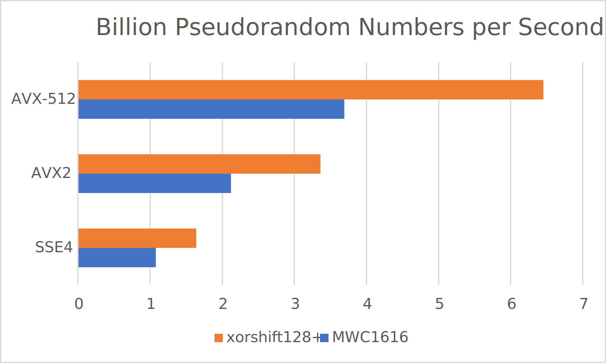

--------------------------------------------------------------------------------

  **Super-Fast MWC1616 [1] and xorshift128+ [2] Pseudo-Random Number Generator
  for x86 Architecture, using SSE4, AVX2 and AVX-512 instructions**
  
  Copyright (c) 2012-2023, Ivan Dimkovic (www.digicortex.net)
  All rights reserved.

  Redistribution and use in source and binary forms, with or without
  modification, are permitted provided that the following conditions are met:

  Redistributions of source code must retain the above copyright notice,
  this list of conditions and the following disclaimer.

  Redistributions in binary form must reproduce the above copyright notice, 
  this list of conditions and the following disclaimer in the documentation 
  and/or other materials provided with the distribution.

  THIS SOFTWARE IS PROVIDED BY THE COPYRIGHT HOLDERS AND CONTRIBUTORS "AS
  IS" AND ANY EXPRESS OR IMPLIED WARRANTIES, INCLUDING, BUT NOT LIMITED TO, THE 
  IMPLIED WARRANTIES OF MERCHANTABILITY AND FITNESS FOR A PARTICULAR PURPOSE
  ARE DISCLAIMED. IN NO EVENT SHALL THE COPYRIGHT HOLDER OR CONTRIBUTORS BE 
  LIABLE FOR ANY DIRECT, INDIRECT, INCIDENTAL, SPECIAL, EXEMPLARY, OR 
  CONSEQUENTIAL DAMAGES (INCLUDING, BUT NOT LIMITED TO, PROCUREMENT OF 
  SUBSTITUTE GOODS OR SERVICES; LOSS OF USE, DATA, OR PROFITS; OR BUSINESS 
  INTERRUPTION) HOWEVER CAUSED AND ON ANY THEORY OF LIABILITY, WHETHER IN 
  CONTRACT, STRICT LIABILITY, OR TORT (INCLUDING NEGLIGENCE OR OTHERWISE) 
  ARISING IN ANY WAY OUT OF THE USE OF THIS SOFTWARE, EVEN IF ADVISED OF THE
  POSSIBILITY OF SUCH DAMAGE.

--------------------------------------------------------------------------------

  REFERENCES:

  [1]  G. Marsaglia, The Marsaglia Random Number CDROM, with the DIEHARD 
  Battery of Tests of Randomness. Department of Statistics, Florida State 
  University, (1996) http://stat.fsu.edu/~geo/diehard.html

  [2] Marsaglia, G. (2003). Xorshift RNGs. Journal of Statistical Software, 
  8(14), 1–6. https://doi.org/10.18637/jss.v008.i14

--------------------------------------------------------------------------------

 USAGE NOTICE:

 Please DO NOT use these pseudo-random number generators for cryptographic
 or security purposes. They are designed for speed and quality of randomness
 only, nothing else. Also, please do not use the MWC1616 generator for
 scientific purposes, as it is not a statistically robust generator.

--------------------------------------------------------------------------------

# Introduction

Code provided here implements two Pseudo Random Number Generators (PRNGs), both
of which are of better quality and performance compared to typical C Runtime
PRNGs supplied with popular C/C++ compilers. In addition, implementations are
using x86 SIMD instruction sets (SSE4, AVX2 and AVX-512) for vectorization
purposes and obtaining maximum performance. Please refer to cited publications
mentioned in the header for more information about the given PRNG properties.

In general, xorshift128+ is recommended for general purposes, outside of areas
of cryptography and security. I have tested the implementations using ent:
https://www.fourmilab.ch/random/ and both implementations behave as one would
expect. You are of course welcome (even encouraged) to run your own battery of
tests such as Diehard Tests (https://stat.fsu.edu/pub/diehard/) or TestU01
from Pierre L'Ecuyer and Richard Simard, available on the following web site:
(http://simul.iro.umontreal.ca/testu01/tu01.html)

# Usage

You just need to include `fastrand.h` header in your C++ source and make sure
that source is compiled using the right instruction set, for example using the
following compiler flags (pick one, given options are just examples, more
options are available, please consult your C/C++ compiler's manual):

**gcc, clang or Intel oneAPI DPC++/C++ Compiler (LLVM based)**
```bash
# AVX-512
-mavx512f
-march=icelake-server

# AVX2
-mavx2
-march=alderlake

# SSE4
-msse4
-march=westmere
```

**MSVC**
```bash
# AVX-512
/ARCH:AVX512

# AVX2
/ARCH:AVX2

# SSE4
# Shall work by default for 64-bit builds

```


Next, you need to use one of the two provided PRNG classes in your code:

```cpp
#include "fastrand.h"

void foo() {

  //
  // Declaration, default constructors will seed the PRNGs

  fastrand::mwc1616 fr_mwc1616;
  fastrand::xorshift128plus fr_xorshift128plus;

  //
  // Generate N 32-bit pseudorandom numbers with MWC1616 PRNG
  // N = 4 for SSE4
  // N = 8 for AVX2
  // N = 16 for AVX-512

  fr_mwc1616.Generate();  // Results are in .res_[] array

  //
  // Generate N 64-bit pseudorandom numbers with MWC1616 PRNG
  // N = 2 for SSE4
  // N = 4 for AVX2
  // N = 8 for AVX-512

  fr_xorshift128plus.Generate();   // Results are in .res_[] array

  //
  // You can repeat .Generate() calls as many times as you wish. Each call to
  // Generate() will generate new batch of pseudorandom numbers
}
```

OR, you can take a look in `fastrand_test.cpp` for more detailed usage info.

# Thread Safety

Please note that implemented PRNGs *ARE NOT* thread-safe. Instead, each thread
shall use its own `fastrand::xorshift128plus` or `fastrand::mwc1616` PRNGs.
They are so lightweight that it makes no sense to share them between threads.
Using synchronization primitives for sharing is not recommended due to
performance reasons.

# Results

Below graph show performance scaling for both MWC1616 and xorshift128+ versions
of the PRNG. Please note that xorshift128+ generates 64-bit values while MWC1616
generates 32-bit values (so, effectively, if one wants to normalize the results
xorshift128+ results shall be multiplied by the factor of 2). Hardware (CPU)
used for testing was a single Intel Xeon Platinum 8375C @ 2.90GHz core, which
is a Ice Lake Server architecture. 

